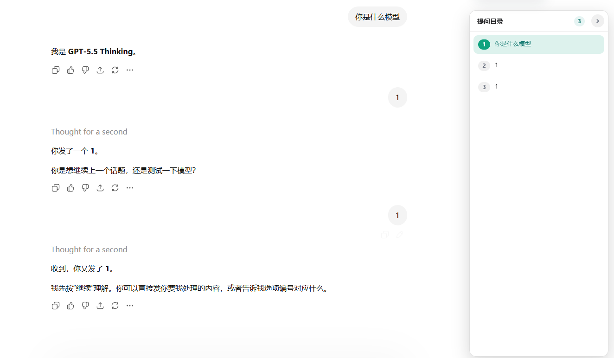

# ChatGPT 提问目录插件

在 ChatGPT 页面右侧显示用户提问目录，方便快速跳转到指定问题。



## 安装方式

1. 打开 Chrome，进入：

   ```text
   chrome://extensions/
   ```

2. 打开右上角 **开发者模式**。

3. 点击 **加载已解压的扩展程序**。

4. 选择本项目文件夹：

   ```text
   GptToc
   ```

5. 打开或刷新 `https://chatgpt.com/`，即可使用。

## 使用

- 右侧会自动显示提问目录。
- 点击目录项可跳转到对应用户提问。
- 目录支持折叠和拖拽调整宽度。

## 🙏 致谢

感谢真诚、友善、团结、专业的 [LinuxDo](https://linux.do/) 社区，让我学到那么多有关 AI 相关知识。

- [LinuxDo](https://linux.do/) 学 AI，上 L 站！
